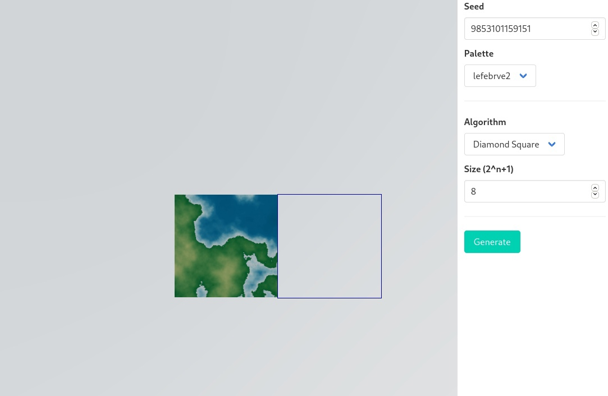
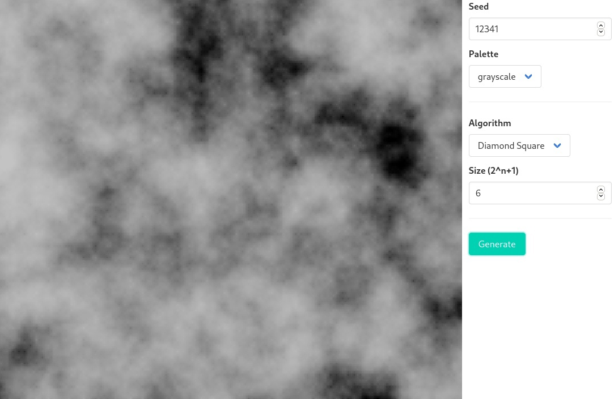
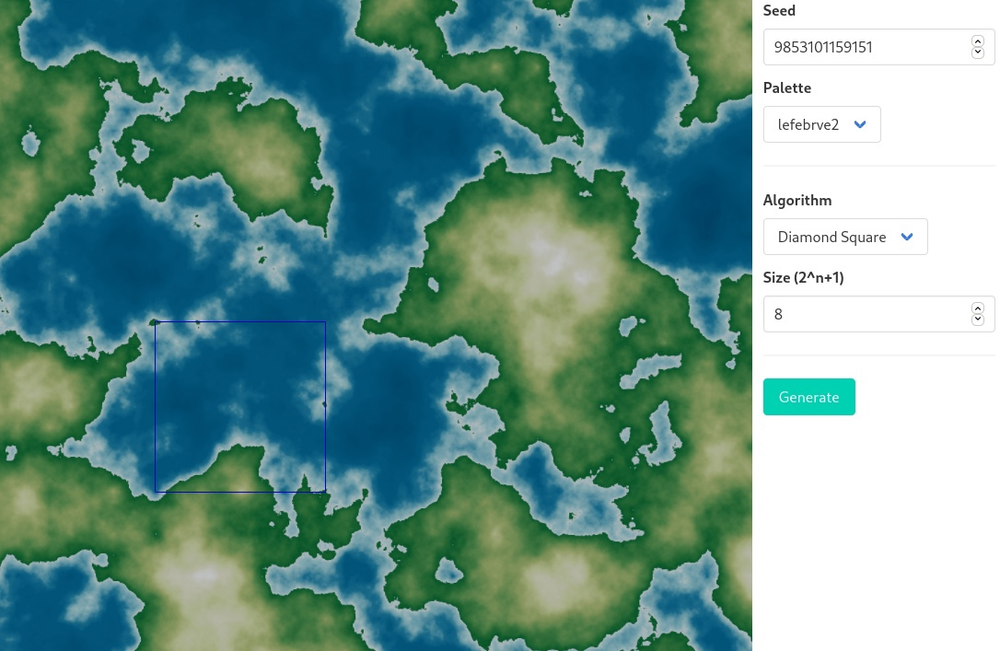
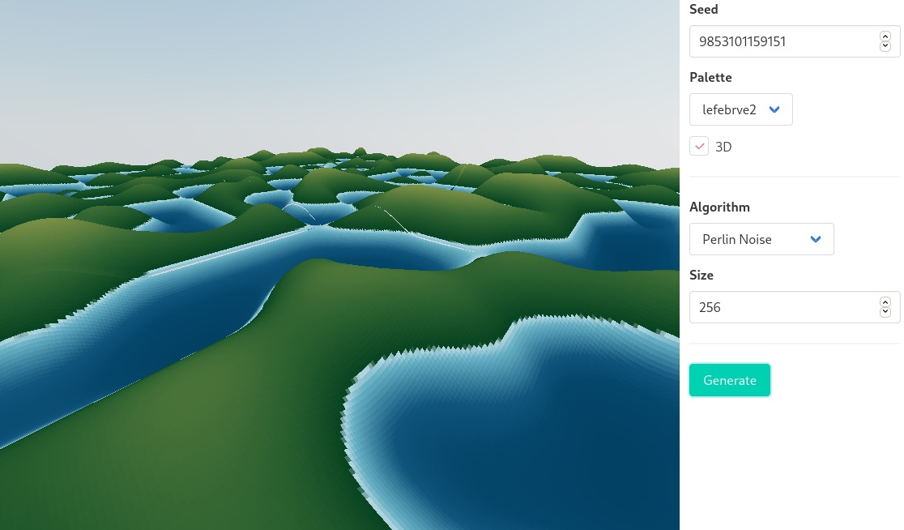

# Anotācija

{{TBD}}

# Saturs

- [Anotācija](#anotācija)
- [Saturs](#saturs)
- [Ievads](#ievads)
- [Teorija](#teorija)
  - [Augstumu karte](#augstumu-karte)
  - [Augstumu karte renderis](#augstumu-karte-renderis)
  - [Algoritmi](#algoritmi)
    - [Perlina troksnis](#perlina-troksnis)
      - [Lietojums](#lietojums)
      - [Sarežģītība](#sarežģītība)
      - [Piemēri](#piemēri)
    - [Diamond-Square](#diamond-square)
      - [Ģenerēšana pa gabaliem (chunk)](#ģenerēšana-pa-gabaliem-chunk)
      - [Priekšrocības](#priekšrocības)
      - [Trūkumi](#trūkumi)
      - [Ģenerēšanas piemēri](#ģenerēšanas-piemēri)
  - [Lietošana](#lietošana)
- [Praktika](#praktika)
  - [Izstrādātās programmas apraksts](#izstrādātās-programmas-apraksts)
  - [Prasības](#prasības)
    - [Realizēts](#realizēts)
    - [Paredzēts izpildīt](#paredzēts-izpildīt)
  - [Lietoti instrumenti](#lietoti-instrumenti)
  - [Gala programmas apraksts](#gala-programmas-apraksts)
- [Literatūru saraksts](#literatūru-saraksts)

# Ievads

Mūsu planētas (Zemes) virsma ir reljefa. Tā ir pilna ar kalniem un ieplakām. Tas ir svarīgi ticami atkārtot Zemas virsmas īpašības, kad lidmašīnu piloti mācās vadīt lidmašīnas uz zemes. Arī videospēlēs ticams landšafts taisa spēles aizrautīgas. Zemes landšafts bija radīts miljonu vai vairāk gadu. Kad ir nepieciešanība imitēt Zemes landšaftu, ir divi risinājumi: manuali un automatiski. Pirmais paņemiens ir ārkārtīgi neefektīvs. Taču otrais atļauj ģenerēt milzīgas teritorijas bez piepūlēm.

Tāpēc tika nolemts izveidot programmatūru, kas varētu ģenerēt dažāda veida fotoreālistiskās ainavas.

Šī darba mērķis ir izpētīt augstumu karšu ģenerēšanas algoritmus.

Galvenokārt tika pētīti Diamond-Square algoritmi un Pērlina troksnis. Ir izdevies tos veidot ar modifikācijām bezgalīgai bezšuvju ģenerēšanai.

# Teorija

## Augstumu karte

Datorgrafikā augstumu karte vai "heightmap" ir rastra attēls, kurā katrs pikselis ir atbildīgs par augstumu: melns apzīmē mazāko augstumu un balts - augstāko.

## Augstumu karte renderis

Ir daudz veidu, kā var attēlot (renderēt) augstumu karti:

- Melnbalts attēls, kur tumši pikseļi attēlo zemāku augstumu un gaišie pikseļi - augstāku. Būtībā tie ir neapstrādāti augstumu kartes dati.\
  

- Attēls, kas krāsots ar paleti. Tas ir vienkārši krāsotas melnbalta augstumu kartes, saskaņā ar kādu paleti.\
  

- Trīsdimensiju attēlojums.\
  

## Algoritmi

### Perlina troksnis

Kenona Perlina 1983. gadā izstrādāts gradienta trokšņa veids.

#### Lietojums

Perlina troksnis ir procesuāls faktūras primitīvs, gradienta trokšņa veids, ko mākslinieki izmanto vizuālajos efektos, lai uzlabotu ārējā izskata reālistiskumu datorgrafikā. Šai funkcijai ir pseido-nejaušs izskats, un visas tās vizuālās daļas ir vienādā izmērā. Šī īpašība ļauj to viegli pārvaldīt; vairākas Perlina trokšņu mērogotas kopijas var ielīmēt matemātiskā izteiksmē, lai izveidotu procesuālu faktūru ar labu mainīgumu. Mākslīgās faktūras bieži izmanto CGI, lai padarītu datora radītu vizuālo materiālu - piemēram, objektu virsmu, uguni, dūmus vai mākoņus - izskatītu dabiskāks, imitējot kontrolētu nejaušu faktūru izskatu dabā.

#### Sarežģītība

Katram trokšņa funkcijas aprēķinam vektoru pozīcijas un gradienta punktu reizinājums jāaprēķina katrā saturošās šūņa mezglā. Tādējādi Pērlina troksnis tiek mērogots ar $O(n ^ 2)$, $n$ mērījumiem.

#### Piemēri

### Diamond-Square

Šī algoritma ideju pirmoreiz prezentēja Furniers, Fusels un Karpenters uz SIGGRAPH 1982.

Algoritms diamond-square tika analizēts ar Gēvinu S. P. Milleru uz SIGGRAPH 1986, un aprakstīja to kā vispār neideāls, jo algoritms rada ievērojamas vertikālās un horizontālās “krokas”, jo ir visnozīmīgākie traucējumi, kas notiek taisnstūra režģī.

Algoritms sākas, izveidojot divdimensiju pikseļu karti, kuras izmērs ir $2^n+1$. Sākotnējās vērtības tiek dotas četriem masīva stūra punktiem, pēc tam tiek lietoti Diamond un Square soļi, kamēr masīvs nav aizpildīts.

- **Solis Square** [^1]\: Katram *kvadrātam* masīvā centrālais punkts tiek noteikts vidējā aritmētiskā virsotnē + nejauša vērtība.

- **Solis Diamond** [^1]\: Katram *rombam* masīvā centrālais punkts tiek noteikts vidējā aritmētiskā virsotnē + nejauša vērtība.

> Katrā iterācijā nejauša lieluma vērtībai jābūt mazākai par iepriekšējo.

**Diamond** soļa laikā rombiem masīva malās var būt tikai 3 virsotnes, nevis 4. Šai problēmai ir vairāki risinājumi. Vieglākais ir izmantot 3 virsotņu vidējo aritmētisko. Vai arī to var ņemt no citas masīva puses. Ja uzdot pirmos leņķiskos punktus vienādus, tad pēdējais paņēmiens dod iespēju savienot augstumu karti ar sevi bez pārtraukuma.

#### Ģenerēšana pa gabaliem (chunk)

Gabalu ģenerēšanai 4 sākumpunktu vietā tiek ņemts bezgalīgs šādu punktu kopums ($2^n$ daudzkārtņu pozīcijās) tā, lai katram gabalam, kura lielums $ 2 ^ n + 1 $, būtu 4 stūra sākuma punkti, ko tā dala ar kaimiņu gabaliņiem.

**Diamond** soļī uz malām tiek ņemts piemērots punkts no kaimiņu gabala. Šī operācija prasa arī, lai blakus esošajā gabalā tiktu izveidots vēlamais punkts. Tomēr tam blakus esošajam gabalam nav jāveido visi punkti, bet tikai tā daļa, kas ir vistuvāk centrālajam.

Tādējādi, lai ģenerētu jebkuru patvaļīgu gabalu, ir jāizveido vismaz 16 sākumpunkti, kas izmantoti 9 gabalos, un pareizajā secībā tie jāvelk līdz centrālajiem **Diamond** un **Square** soļiem, ģenerējot visu daļu un dažus punkti apkārt.

#### Priekšrocības

- Algoritma sarežģītība ir $O(N)$, t.i. darba laiks ir lineāri atkarīgs no augstumu kartes lieluma. $N$ - augstumu kartes punktu daudzums.

#### Trūkumi

- Daži raksturīgi "artefakti", kas pasliktina rezultātu, piemēram:
    - Augstienēm un ielejām var būt raksturīga *zvaigznes* forma.
    - Augstienes un ielejas visbiežāk sastopamas daudzkārtņu punktos $2^n$, $2^n/2$, $2^n/4$ utt.
  > Šos trūkumus var labi izlīdzināt.
- Atšķirībā no Perlina trokšņa, neradot noteiktu apgabalu, nevar iegūt viena punkta augstumu.
- Radītās vērtības netiek normalizētas.

[^1]: Dažādos avotos šo soļu nosaukumi tiek mainīti.

#### Ģenerēšanas piemēri

## Lietošana

{{TBD}}

# Praktika

Ņemot vērā to, ka esošie atrastie risinājumi neatbilda tālāk norādītajām prasībām, tika nolemts izstrādāt savu programmatūru, kas veicina darba autora zināšanu, prasmju un iemaņu attīstību.

## Izstrādātās programmas apraksts

## Prasības

- Crossplatforms. Lietojumprogrammai vajadzētu darboties jebkurā operētājsistēmā.
- Pielāgojamība
    - Vairāku definētu algoritmu izvēle par pamatu.
    - Dažādu ģenerēsanas parametru iestatīšanas iespēja.
        - Dažādas konstantas vērtības, kas atbild par principā nenozīmīgu atšķirību radīšanu.
        - Dažādu ģenerēsanas režīmu izvēle, ja algoritms to atbalsta.
- Bezgalīgu ģenerētu karšu atbalsts.
- Renderings
    - Kartes divdimensiju renderis uz plaknes. Dažādas paletes.
    - Trīsdimensiju augstumu kartes attēlojums.
- Attālināta skaitļošana. Sakarā ar to, ka ģenerēšanas laikā veiktie aprēķini ir diezgan sarežģīti, ir jāpievieno iespēja veikt šos aprēķinus nevis tieši klientā, bet gan attālajā serverī.
- Dažādu algoritmu kompozīcija reālākiem rezultātiem iegušanai.

### Realizēts

- Crossplatforms. Aplikācija ir realizēta uz tīmekļa tehnoloģijām, un to var izmantot no jebkura brauzera.
- Aplikācijas klienta puse ir rakstīta F# programmēšanas valodā, izmantojot Fable kompilatoru, lai tulkotu avota kodu JavaScript. 3D (un 2D) renderēšanai tiek izmantota bibliotēka Three.js.
- Aplikācijas servera puse ir rakstīta F# programmēšanas valodā, .NET platformā, ASP.NET Core serverī.
- Skaitlisko parametru norādīšana algoritmu ģenerēšanai.
- Algoritmi
    - Diamond-Square algoritms ir veikts ar iespēju bezgalīgi bezšuvju ģenerēšanai pa gabaliem. Ir veikts arī attēlojums, kurā redzami interpolēti (vidēji aprēķināti) rezultāti.
    - Perlina trokšņu algoritms, matemātiski pareiza veikšana, bez vienkāršojumiem.
- Attēlojums, izmantojot dažādas paletes.
- Trīsdimensiju renderings.

### Paredzēts izpildīt

- Iespēja norādīt patvaļīgas funkcijas, kas nepieciešamas algoritmam, ja tas tās atbalsta, ar sekojošu šo funkciju izpildi servera pusē.
- Ģenerēšana un parādīšana sfērā.

## Lietoti instrumenti

- .NET — izstrādes platforma
- ASP.NET Core — frameworks serveru rakstīšanai .NET platformā. Tika izmantots servera puses rakstīšanai.
- F# — programmēšanas valoda. Tika izmantota fullstack izstrādei.
- Fable — F# programmēšanas valodas kompilators JavaScript programmēšanas valodā, kuru pēc tam var izmantot tīmekļa izstrādei.
- Three.js — JavaScript bibliotēka 3D datorgrafikai.
- React — JavaScript frameworks reactivam GUI (Graphical User Interface).

## Gala programmas apraksts

Pirmkods atrodas attālajā GitLab serverī, izmantojot vadības sistēmu
versijas (VCS) Git: [https://gitlab.com/p-dev/ppgen](https://gitlab.com/p-dev/ppgen)

Programmu var pārbaudīt saitē (adrese) {{указать ссылку}}.

# Literatūru saraksts

- Lielā mērā darbs tika iedvesmots ar citu darbu par līdzīgu tēmu.
    - Prezentācija: http://hjemmesider.diku.dk/~torbenm/Planet/PSIslides.pdf
    - Web Interface: https://topps.diku.dk/torbenm/maps.msp
